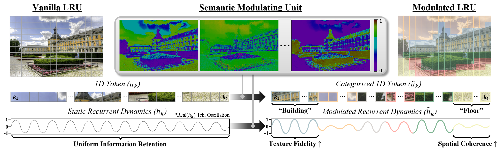
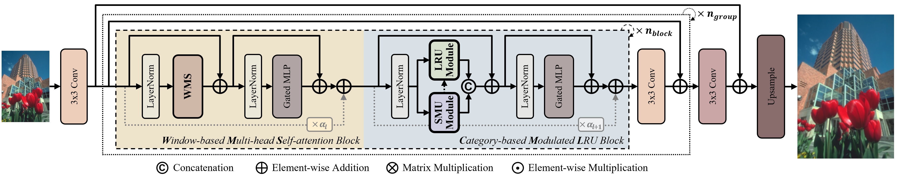
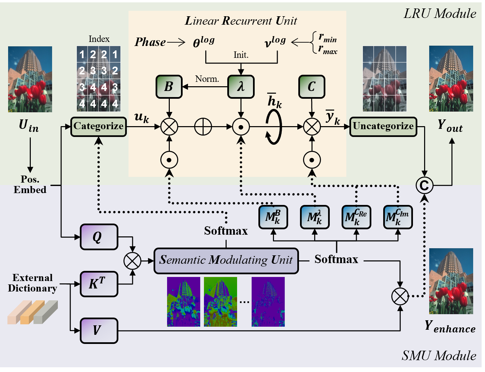
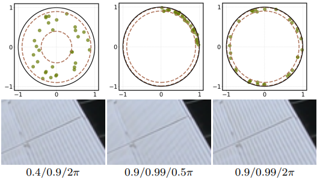
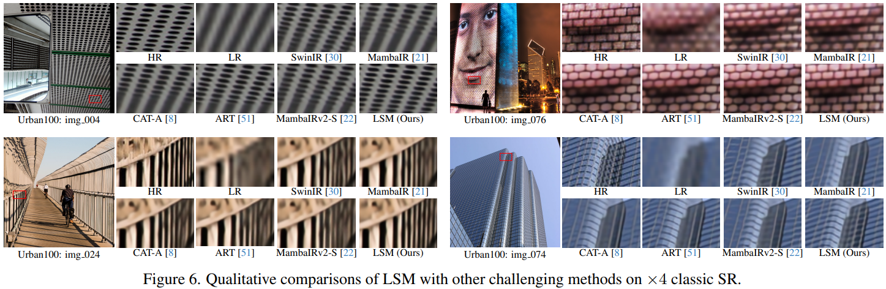
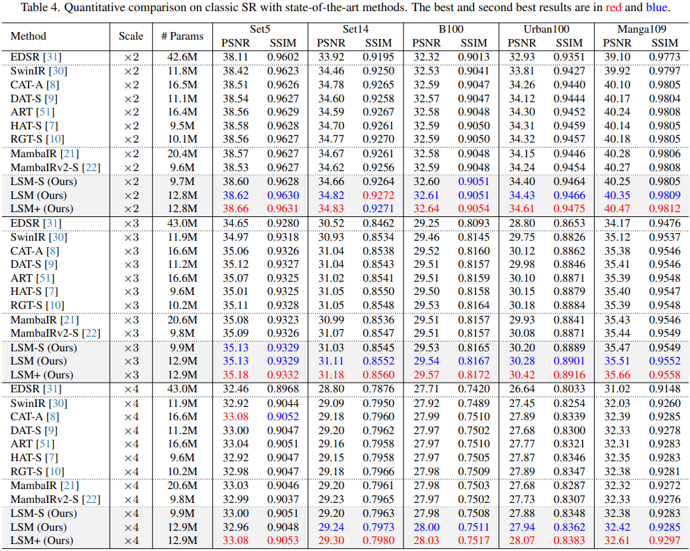
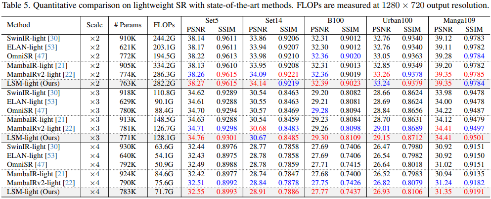

<h1 align="center">
Linear Recurrent Unit with Semantic Modulation for Image Super-Resolution
</h1>

<p align="center">
  <a href="#"><strong>Mingyu Choi</strong></a> ·
  <a href="#"><strong>Woo Kyoung Han</strong></a> ·
  <a href="#"><strong>Sunghoon Im</strong></a> ·
  <a href="#"><strong>Kyong Hwan Jin</strong></a>
</p>

<h2 align="center">
CVPR 2026 Findings
</h2>

<p align="center">
  <a href="####">
    
  </a>
  <a href="####">
    
  </a>
  <a href="https://github.com/MingyuChoi-run/LSM">
    
  </a>
</p>

> **Abstract:** Linear recurrent unit (LRU), designed with a principled formulation for stable linear recurrence, has demonstrated promising accuracy and robustness on long-range dependency tasks. However, its static parameterization and single-scan method limits its applicability to 2D vision tasks. In this study, we propose a LRU-based restoration network with a semantic modulating unit (SMU) to achieve a harmonious balance between performance and efficiency in single-image super-resolution. The SMU plays three key roles: LRU modulation, spatial categorization, and feature enhancement through learned prototype. Extensive experiments demonstrate that our method quantitatively and qualitatively surpasses recent state-of-the-art methods. Notably, our approach achieves superior performance with computational complexity on par with existing methods.

<p align="center">
  
</p>

<p align="center">
  
</p>

<!-- <p align="center">
  
  
</p> -->

## Contents

1. [Visual Results](#visual-results)
2. [To Do](#to-do)
3. [Environment](#environment)
4. [Installation](#installation)
5. [Training Instruction](#training-instruction)
6. [Testing Instruction](#testing-instruction)
7. [Results](#results)
8. [Citation](#citation)
9. [Acknowledgements](#acknowledgements)

## Visual Results

<p align="center">
  
</p>

## TO DO

- [x] Build the repository
- [x] Release the source code
- [x] Add installation instructions
- [x] Add dataset preparation guidelines
- [x] Add training commands for SR
- [x] Add testing commands for SR
- [x] Add SR quantitative results
- [x] Add SR visual comparison figures
- [ ] Upload pretrained weights
- [ ] Add Gaussian Color Image Denoising code, configs, and results
- [ ] Add JPEG Compression Artifact Removal code, configs, and results
- [ ] Add Image Deraining code and configs, and results
- [ ] Upload visual results

## Environment
- Ubuntu 20.04
- CUDA 12.1
- Python 3.8
- PyTorch 2.0.1

### Installation

```bash
git clone https://github.com/MingyuChoi-run/LSM.git
cd LSM

conda create -n lsm python=3.8
conda activate lsm

pip install -r requirements.txt
```

## Training Instruction

### Datasets

Used training and testing sets can be downloaded as follows:

| Task | Training Set | Testing Set |
| :--- | :---: | :---: |
| Classical Image SR | [DIV2K](https://cv.snu.ac.kr/research/EDSR/DIV2K.tar) (800 images) + [Flickr2K](https://cv.snu.ac.kr/research/EDSR/Flickr2K.tar) (2650 images) | Set5 + Set14 + B100 + Urban100 + Manga109 [[download]](https://drive.google.com/file/d/1_FvS_bnSZvJWx9q4fNZTR8aS15Rb0Kc6/view?usp=sharing) |
| Lightweight Image SR | [DIV2K](https://cv.snu.ac.kr/research/EDSR/DIV2K.tar) (800 images) | Set5 + Set14 + B100 + Urban100 + Manga109 [[download]](https://drive.google.com/file/d/1_FvS_bnSZvJWx9q4fNZTR8aS15Rb0Kc6/view?usp=sharing) |
| Color Gaussian Image Denoising | [DIV2K](https://cv.snu.ac.kr/research/EDSR/DIV2K.tar) (800 images) + [Flickr2K](https://cv.snu.ac.kr/research/EDSR/Flickr2K.tar) (2650 images) + [WED](https://ivc.uwaterloo.ca/database/WaterlooExploration/exploration_database_and_code.rar) (4744 images) + [BSD500](https://drive.google.com/file/d/12oYmda-cC54XG5019EI17g0GG9qxybe9/view?usp=sharing) (500 images) | CBSD68 + Kodak24 + McMaster + Urban100 [[download]](https://drive.google.com/file/d/11374-202z7ULaA50FKUMXAlVeOykTvGo/view?usp=sharing) |
| Grayscale JPEG CAR | [DIV2K](https://cv.snu.ac.kr/research/EDSR/DIV2K.tar) (800 images) + [Flickr2K](https://cv.snu.ac.kr/research/EDSR/Flickr2K.tar) (2650 images) + [WED](https://ivc.uwaterloo.ca/database/WaterlooExploration/exploration_database_and_code.rar) (4744 images) + [BSD500](https://drive.google.com/file/d/12oYmda-cC54XG5019EI17g0GG9qxybe9/view?usp=sharing) (500 images) | Classic5 + LIVE1 + Urban100 [[download]](https://drive.google.com/file/d/16rZLCcLg9yXD9jyromwy4UL0A5AhU_Wm/view?usp=sharing) |
| Image Deraining | [Rain13K](https://drive.google.com/file/d/14BidJeG4nSNuFNFDf99K-7eErCq4i47t/view?usp=sharing) (13,712 clean/rain image pairs) | Test2800 [[download]](https://drive.google.com/file/d/1P_-RAvltEoEhfT-9GrWRdpEi6NSswTs8/view?usp=sharing) |

### Commands

Follow the instructions in `options/train` folder to begin training our model.

<details>
<summary>Classical Image Super-Resolution</summary>

```bash
# 8 GPUs, batch size=4 per GPU

# input size = 64x64, x2 scratch
python -m torch.distributed.launch --nproc_per_node=8 --master_port=1111 basicsr/train.py -opt options/train/train_LSM_S_SR_x2_scratch.yml --launcher pytorch
# input size = 96x96, x2 finetune
python -m torch.distributed.launch --nproc_per_node=8 --master_port=1111 basicsr/train.py -opt options/train/train_LSM_S_SR_x2_finetune.yml --launcher pytorch
# input size = 96x96, x3 finetune
python -m torch.distributed.launch --nproc_per_node=8 --master_port=1111 basicsr/train.py -opt options/train/train_LSM_S_SR_x3_finetune.yml --launcher pytorch
# input size = 96x96, x4 finetune
python -m torch.distributed.launch --nproc_per_node=8 --master_port=1111 basicsr/train.py -opt options/train/train_LSM_S_SR_x4_finetune.yml --launcher pytorch
```

</details>

<details>
<summary>Lightweight Image Super-Resolution</summary>

```bash
# 2 GPUs, batch size=32 per GPU

# input size = 64x64, x2 scratch
CUDA_VISIBLE_DEVICES=0,1 python -m torch.distributed.launch --nproc_per_node=2 --master_port=1111 basicsr/train.py -opt options/train/train_LSM_light_lightSR_x2_scratch.yml --launcher pytorch
# input size = 96x96, x2 finetune
CUDA_VISIBLE_DEVICES=0,1 python -m torch.distributed.launch --nproc_per_node=2 --master_port=1111 basicsr/train.py -opt options/train/train_LSM_light_lightSR_x2_finetune.yml --launcher pytorch
# input size = 96x96, x3 finetune
CUDA_VISIBLE_DEVICES=0,1 python -m torch.distributed.launch --nproc_per_node=2 --master_port=1111 basicsr/train.py -opt options/train/train_LSM_light_lightSR_x3_finetune.yml --launcher pytorch
# input size = 96x96, x4 finetune
CUDA_VISIBLE_DEVICES=0,1 python -m torch.distributed.launch --nproc_per_node=2 --master_port=1111 basicsr/train.py -opt options/train/train_LSM_light_lightSR_x4_finetune.yml --launcher pytorch
```

</details>

<details>
<summary>Gaussian Color Image Denosing</summary>

```bash
# To be updated soon.
```

</details>

<details>
<summary>JPEG Compression Artifact Removal</summary>

```bash
# To be updated soon.
```

</details>

<details>
<summary>Image Deraining</summary>

```bash
# To be updated soon.
```

</details>

## Testing Instruction

### Pretrained Models

Pretrained models will be released soon.

After downloading the pretrained models, put them into the `experiments/pretrained_models` folder

### Commands

Follow the instructions in `options/test` folder to begin testing our model.

<details>
<summary>Classical Image Super-Resolution</summary>

```bash
python basicsr/test.py -opt options/test/test_LSM_S_SR_x2_finetune.yml
python basicsr/test.py -opt options/test/test_LSM_S_SR_x3_finetune.yml
python basicsr/test.py -opt options/test/test_LSM_S_SR_x4_finetune.yml
```

</details>

<details>
<summary>Lightweight Image Super-Resolution</summary>

```bash
python basicsr/test.py -opt options/test/test_LSM_light_lightSR_x2_finetune.yml
python basicsr/test.py -opt options/test/test_LSM_light_lightSR_x3_finetune.yml
python basicsr/test.py -opt options/test/test_LSM_light_lightSR_x4_finetune.yml
```

</details>

<details>
<summary>Gaussian Color Image Denoising</summary>

```bash
# To be updated soon.
```

</details>

<details>
<summary>JPEG Compression Artifact Removal</summary>

```bash
# To be updated soon.
```

</details>

<details>
<summary>Image Deraining</summary>

```bash
# To be updated soon.
```

</details>

## Results

<details>
<summary>Classic Image Super-Resolution</summary>

<p align="center">
  
</p>

</details>

<details>
<summary>Lightweight Image Super-Resolution</summary>

<p align="center">
  
</p>

</details>

<details>
<summary>Gaussian Color Image Denoising</summary>

```bash
# To be updated soon.
```

</details>

<details>
<summary>JPEG Compression Artifact Removal</summary>

```bash
# To be updated soon.
```

</details>

<details>
<summary>Image Deraining</summary>

```bash
# To be updated soon.
```

</details>

## Citation

If you find this work useful, please consider citing:

```bash
# To be updated soon.
```

<!-- ```bibtex
@inproceedings{choi2026lsm,
  title={Linear Recurrent Unit with Semantic Modulation for Image Super-Resolution},
  author={Choi, Mingyu and Han, Woo Kyoung and Im, Sunghoon and Jin, Kyong Hwan},
  booktitle={Proceedings of the IEEE/CVF Conference on Computer Vision and Pattern Recognition},
  year={2026}
}
``` -->

## Acknowledgements

This code is built on [BasicSR](https://github.com/XPixelGroup/BasicSR). We thank the authors of open-source image restoration repositories for their valuable contributions.